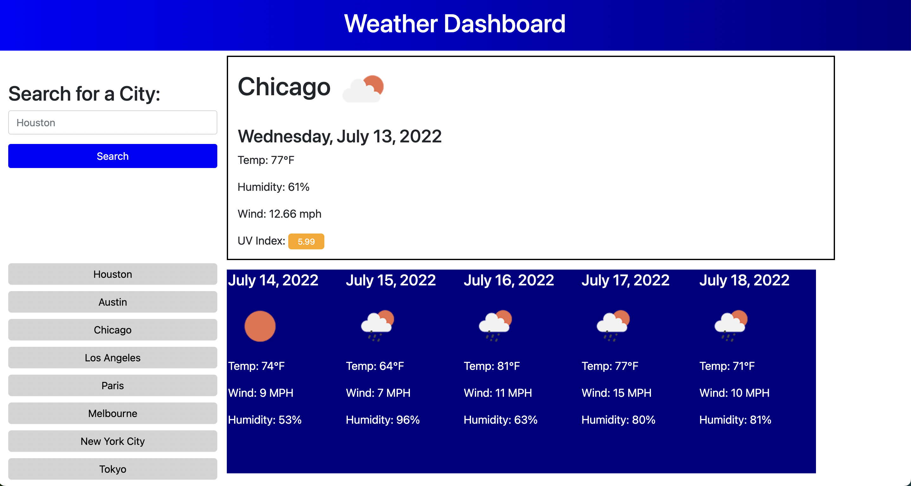

# Weather Dashboard

Deployed link: https://andcooke.github.io/weather-dashboard/

Deployment Date - July 12,2022

## Usage
Type your desired city in the search bar and click search.

    
Current weather and a 5 day forecast will appear

All recently searched cities will be saved allowing the user to select that button again to see an updated weather report.

## Lessons Learned 
    - Learned more about inserting parameters into a function and calling that function.
    - Learned more about local storage and how to implement it.
    - Learned specifically about the span element in HTML that allows a user to append inline text.

## Improvement

    -The site needs front end work. Things are not spaced as I would like, but everything works as desired. 
    -Also, if a user types a city wrong, the site saves a button with the mistaken city and doesn't produce accurate weather results.
    

## Contributors:

[Andrew Cooke](https://github.com/andcooke) supplied most of the work here.  
[Meg Meyers](https://github.com/femke77) worked out all of the kinks.
    
    

    
    
    
    

    

